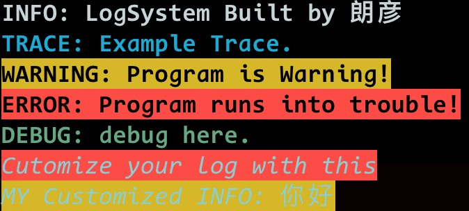

<div id="title" style="text-align: center">
    <h1 style="
    background: -webkit-linear-gradient(left, red, orange, red, red, orange, blue, green, red, yellow, violet);
    background: -o-linear-gradient(right, orange, yellow, green, cyan, blue, violet);
    background: -moz-linear-gradient(right, orange, yellow, green, cyan, blue, violet);
    background: linear-gradient(to right cyan, blue, green, red, yellow, violet);
    -webkit-background-clip: text;
    -webkit-text-fill-color: transparent;
    ">LogSystem</h1>
    <p style="color: grey">Created by Langyan Zang</p>
</div>


This repository is meant to help my C++ Game Engine development. The simple macros defined in it can display colorful information, showing priority, during runtime. Also, it is totally customizable.

## Usage
Simply include `LogSystem.h` file in your project, and all set. Customize it as you like.

The following shows an example and the output in on Mac OS iTerm terminal.
```cpp
#include "LogSystem.h"

#define MY_INFO(s) LOG("MY Customized INFO: " s, "1;3;7;", "106;33")

int main(){
  INFO("LogSystem Built by 朗彦");
  TRACE("Example Trace.");
  WARN("Program is Warning!");
  ERROR("Program runs into trouble!");
  DEBUG("debug here.");

  LOG("Cutomize your log with this", "1;3;7;","106;31");

  MY_INFO("你好");
}
```
The output of the example included in this repository is as follows, which runs on iTerm on Mac OSX.


